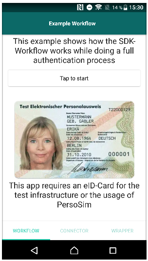

# nativescript-ausweisapp-sdk-wrapper

This plugin wraps the Ausweisapp2 SDK to a simpler Javascript API.

Official documentation at https://www.ausweisapp.bund.de/sdk/

## DEMO

Contains a DEMO angular application



Run DEMO 
```bash
    $ cd demo-angular
    $ tns debug android
```

Consider using [PersoSim](https://persosim.secunet.com/de/downloads/) to simulate a test eID-Card.

## Installation

Install this plugin regulary with this command

```bash
tns plugin add nativescript-ausweisapp-sdk-wrapper
```

### Integration in app
Head over to the guide here on [how to integrate this API in your project](./HOW_TO_INTEGRATE.MD)

There you will find details on how to

1. Create required activity
2. Configure webpack
3. Edit AndroidManifest.xml

## Usage 


Use this typings definition for Typescript and adding IntelliSense support.

```
/// <reference path="./node_modules/nativescript-ausweisapp-sdk-wrapper/typings/ausweisapp-sdk-wrapper-android-declarations.d.ts" />
```

```typescript
    let foregroundActivity = androidApp.foregroundActivity as globalAndroid.app.Activity
    const wrapper = sf.AusweisappSDKWrapper.getInstance(foregroundActivity) as sf.AusweisappSDKWrapper
    const callbacks = [
        new sf.MessageCallbackPair(sf.Message.__ANY_MESSAGE,
            new sf.IMessageCallback({
                onMessage: (message: sf.Message, jsonObject: JSONObject) => {
                    console.log(`received`, `message:${message}`, `${jsonObject.toString(2)}`)
                }
            }))
    ]
    wrapper.onReady(new sf.AusweisappSDKConnector.IAusweisappSDKConnectorListener({
        onReady: () => {
            console.log(`SDK wrapper is ready now`)
            wrapper.getCommander().exec(sf.Command.SET_PIN, new JSONObject().put('value', '123456'), callbacks)
        },
        onDisconnect: () => {
            console.log(`SDK wrapper disconnected`)
        },
        onError: (throwable: java.lang.Throwable) => {
            console.log(`SDK wrapper failed:`, `${throwable}`)
        }
    }))
```

## API

See [API usage guide here](./API_USAGE.MD) for a deeper look inside.

Also take a look to the official documentation site of the Ausweisapp SDK at https://www.ausweisapp.bund.de/sdk/


## License

Apache License Version 2.0, January 2004
